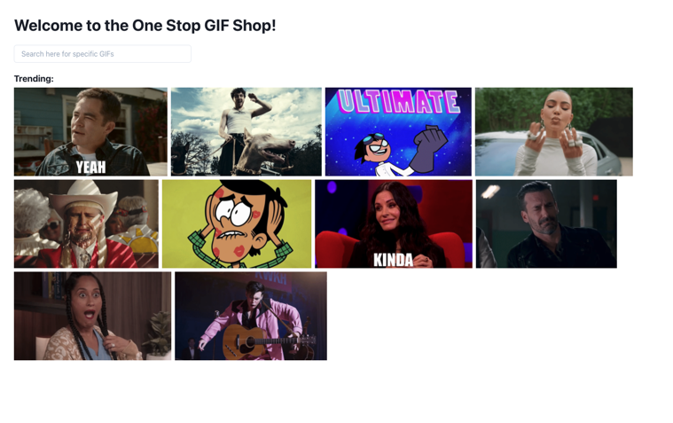

# Gyfcat App

A simple React gyfcat app, based on [gfycat.com](https://gfycat.com), leveraging [axios](https://axios-http.com/docs/intro) (Promise based HTTP client for the browser and node.js) and connecting to Gyfcat APIs (see Gyfcat developer docs [here](https://developers.gfycat.com/api/#introduction)).



For examples of the utilised endpoints in this app, see the Postman collection (Collection requires environment variables: `client_id` & `client_secret`):
[https://www.getpostman.com/collections/71084798010fb57fe28f](https://www.getpostman.com/collections/71084798010fb57fe28f)

_(Created only for educational purposes - not intended to be for production)_

## Setup

First step, create a Gyfcat developer account to get your client_id and client_secret here:
[https://developers.gfycat.com/signup](https://developers.gfycat.com/signup/#/)

Then, create a `.env` file and add to the project root.
Populate the .env file with the Gyfcat client_id like so:

```
REACT_APP_CLIENT_ID = "XXXXXXXXXXXXXXX"
```

**Important Note:**

Because this is a React Single Page (Web) App the `client_secret` should **not** be configured under environment variable. Client Secret could easily be eavesdropped on.

This Gyfcat App requires only `client_id` because it follows the GyfCat Browser-Based Authorization Flow. See more info on the browser flow here: [https://developers.gfycat.com/api/#browser-based-authentication](https://developers.gfycat.com/api/#browser-based-authentication)

## Install

Install project requirements:

```
npm install
```

## Available Scripts

In the project directory, you can run:

```
npm start
```

Runs the app in the development mode.\
Open [http://localhost:3000](http://localhost:3000) to view it in your browser.

The page will reload when you make changes.\
You may also see any lint errors in the console.
